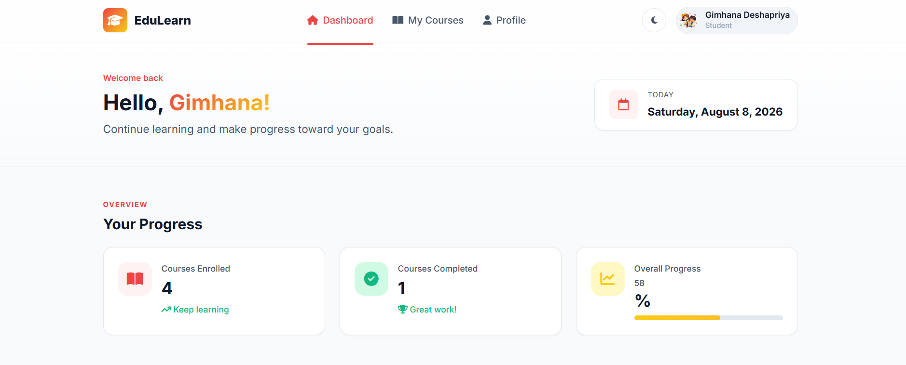

# Front-End Task - PowerX

A responsive learning management system (LMS) course dashboard built with HTML, CSS, and JavaScript.

**EduLearn - LMS Course Dashboard**

## Technologies Used

- HTML5
- CSS3
- JavaScript
- Google Fonts (Inter)
- Font Awesome icons

## Features Implemented

- Responsive desktop and mobile layout
- Search courses by title or instructor
- Filter courses by category
- Sort courses by progress
- Display enrolled courses, completed courses, and overall progress
- View course information in a details modal
- Show an empty state when no courses match the filters
- Clear all active filters with one button

## Bonus Tasks

- Dark mode with the selected theme saved in `localStorage`
- Animated course and overall progress bars
- Responsive mobile navigation menu
- Dynamically generated course cards using JavaScript
- Automatically updated current date and footer year

## How to Run the Project

No package installation or build step is required.

1. Clone or download this repository.
2. Open the project directory.
3. Open `index.html` in a modern web browser.

Alternatively, start a local development server from the project directory:

 

## Screenshots

Save a screenshot of the completed dashboard as `images/Screenshots/image copy.png`. It will appear below automatically:

.


## Project Structure

```text
Front-End-Task-PowerX/
|-- index.html
|-- css/
|   `-- style.css
|-- js/
|   `-- script.js
|-- images/
`-- README.md
```

## Customization

- Edit course information in the `courses` array in `js/script.js`.
- Update colors, spacing, and responsive styles in `css/style.css`.
- Change page content and navigation in `index.html`.

The Inter font and Font Awesome icons are loaded from external CDNs, so an internet connection is required for those resources.
